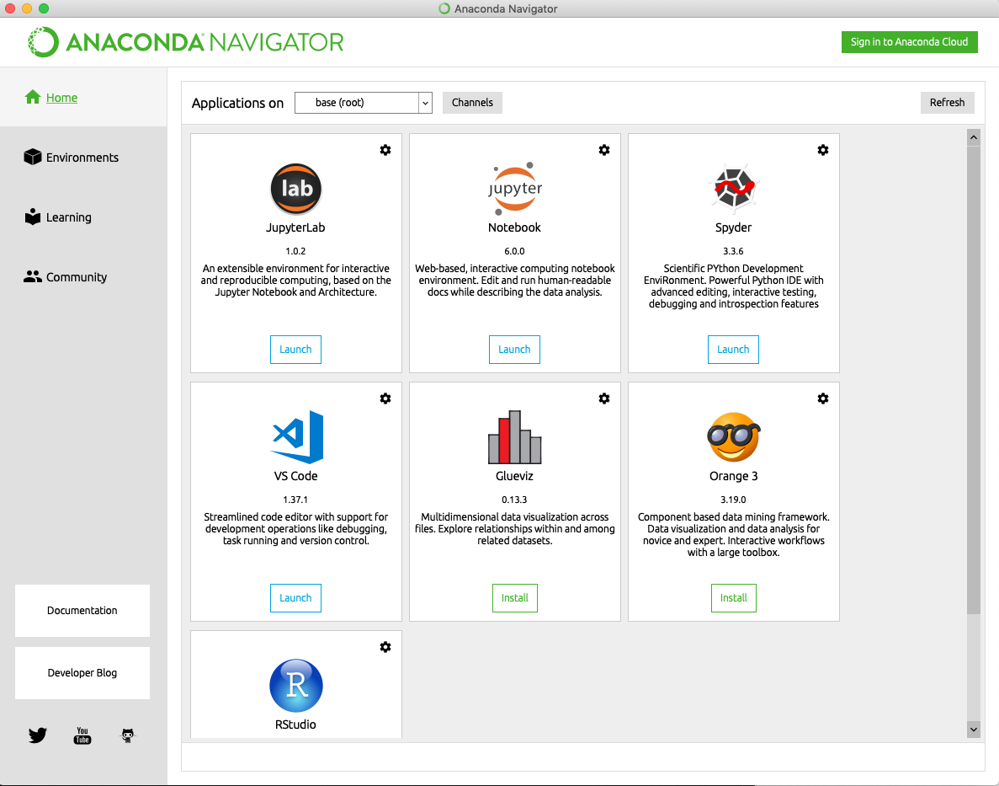
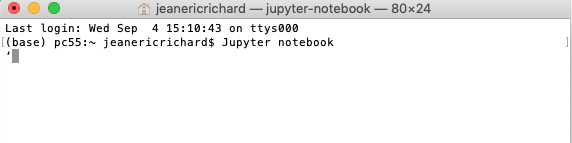

<h1>Fichiers pour NSI</h1>

Sécance du 3/09/2019

Un lien vers [programme officiel](https://disciplines.ac-toulouse.fr/informatique/programme-nsi-classe-de-premiere)

Ensuite, il va falloir remplir la fiche de renseignement et me la renvoyer par mail.

Après il va être question de Python !

J'ai mis deux fichiers .py, que savez-vous faire avec ?

Et la suite, nous allons travailler avec des notebooks, ici le fichier S1-basespython.ipynb !

Installer Python sur son ordinateur !
D'abord on vérifie que Python n'est pas installé...

S'il l'est, quelle est la version ?

Il est installé de base sur certains systèmes d'exploitation (les bons d'ailleurs).

Sinon, on va là [Site officiel de Python](https://www.python.org)

On télécharge, on installe et après on s'en sert comment ?

Bien il y a plein d'utilitaires, on peut utiliser Idle (s'il est intégré à l'installation suivant les systèmes d'exploitation).

Mais aussi :

 L'IDE [Pyzo](https://pyzo.org/start.html) 

 L'IDE [vscode](https://code.visualstudio.com)
 
 L'IDE [Thonny](https://thonny.org)

 L'IDE [Atom](https://atom.io)

On peut aussi utiliser [Notepad++](https://notepad-plus-plus.org/fr/), [Sublimetext](https://www.sublimetext.com), et plein d'autres...

Une distribution très complète mais très lourde à mettre en place : [Anaconda](https://wwww.anaconda.com)

On complétera si nécessaire !

Quelques précisions :

 Voici une image du navigateur Anaconda (MacOS) :

 

 En ce qui concerne l'usage de Jupyter Notebook au lycée, on pourrait faire commme cela 
  
 
 mais à ce jour cela ne fonctionne pas !

 Donc on passe par une version en ligne via ce site :
 [Jupyter on line ](https://jupyter.org/try) et on clique sur Try Classic notebook ou Try Jupyter Lab.

 Après suivant le nombre de connexions... il se peut que cela soit pénible... faute de mieux à ce jour, je vais mettre la version PDF du fichier de travail. Il faudra ensuite appliquer les consignes données en classe et utiliser Pyzo ou Idle par exemple pour le côté Python.

 

 En informatique on peut en apprendre tous les jours, c'est d'ailleurs ce qui fait le charme de cette discipline  comme en Mathématiques d'ailleurs mais ce n'est pas le sujet du jour. 
 
 Mon excellente collègue, Madame Bessonnet m'avait indiqué que l'on pouvait aussilire des fichiers Jypyter Notebook via les utilitaires mis en ligne par Google. 

 J'ai testé pour vous et cela marche aussi, mais pour cela il faut un compte Google ! On peut aussi être plus curieux et lire ceci [Six easy ways to run your Jupyter Notebook in the cloud](https://www.dataschool.io/cloud-services-for-jupyter-notebook/)

 Un truc pas mal c'est que l'on peut lier directement mon dépôt Github à l'utilitaire mis en place par Google ! 

 1. le lien [Colab de Google](https://colab.research.google.com/notebooks/welcome.ipynb)

 2. Se connecter à son compte Google !

 3. fichier : importer un notebook
 4. Choisir l'onglet github et chercher juste mon nom de dépôt : jeaneric66
 5. Choisir le bon fichier .ipynb 
 6. L'enregistrer dans son Drive, le renommer et travailler avec !

 Fin du jour le 07/09 à 18:40 !
 

 Ajout de deux fichiers : exemple.txt que l'on peut créer directement avec un simple éditeur de textes. Ensuite une feuille d'exercices (comme si on avait pas assez de travail...) pour progresser en python.
 Pour cette dernière feuille faire l'essentiel en débranché si possible !