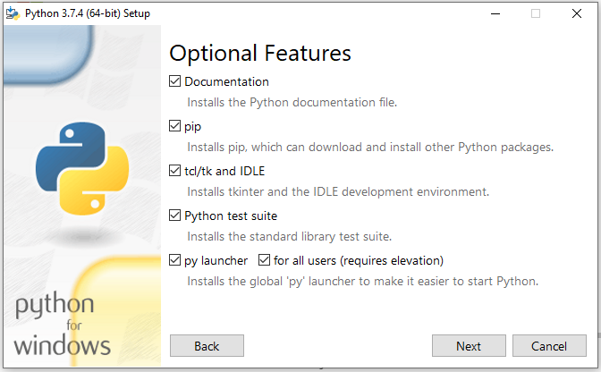

# Installer Python et Jupyter Notebook sous Windows 10 (64 bits)
___________________

---

L'ensemble des instructions provient du site suivant :
 https://medium.com/@kswalawage/install-python-and-jupyter-notebook-to-windows-10-64-bit-66db782e1d02

---

1. Installation d'une version de Python (64 bits), l'exemple est ici **Python 3.7.4** (à vous d'adapter votre choix de version)

Télécharger la version :
https://www.python.org/downloads/

**Ce jour, 29/08/2022, la dernière version téléchargeable est 3.10.6** je vous conseille cependant de télécharger la version 3.9.12, le but n'étant pas 
d'être sur la dernière version, car cela peut poser des problèmes de mise à jour de certains modules.
---

2. Choisir et sélectionner **x86-64 executable installer** pour Windows 10-64 bits

---

3. Sélectionner le dossier pour sauvegarder le fichier qui va être télécharger (on peut sélectionner le dossier téléchargement par exemple...)

---

4. Installer alors Python 3.7.4 (ou une autre version) sur votre ordinateur

Cocher la case **Add Python 3.7 to PATH**ins

---

5. Ouvrir un Terminal **cmd.exe**
 > Vérifier la version installée en tapant python -- version

 > Puis lancer Python et tester l'instruction **print("coucou")

 

Sous Mac j'ai fait ceci, il y a une version 2.7 installée de base, et l'on voit que deux versions cohabitent.

---

1. Mettez à jour **pip** par la commande 
> **python -m pip install -upgrade pip** 

---

### A partir d'ici je sors du tutoriel... car c'est trop compliqué et en plus cela ne fonctionne pas chez moi... Par contre ce que je propose marche sous Windows sur mon ordinateur personnel !
---

7. Installer notebook
   
> **pip install notebook**

---

8. Lancer notebook en ligne de commande dans firefox
   
> **python -m notebook --browser=firefox**

ou bien sans spécifier le navigateur :

> **python -m notebook**

---

9. Si cela ne marche pas... soit j'ai oublié d'installer quelque chose, soit une visio à distance s'impose !

---

10. What else ??? 
  